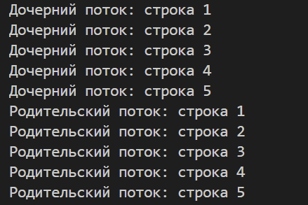
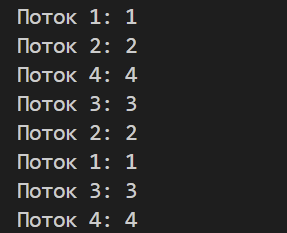
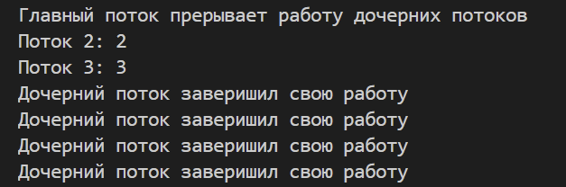
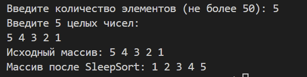

# Лабораторная №16

## Задание 1-2

Заставляет родительский поток ждать завершения дочернего с помощью pthread_join(), а значит сначала выводятся строки дочернего потока, потом родительского

## Задание 3

Создаются 4 потока одновременно, и каждый из них выводит свою уникальную последовательность строк

## Задание 4-5

Через 2 секунды после запуска все потоки прерываются с помощью pthread_cancel и дочерний поток перед завершение распечатывает сообщение об этом с помощью pthread_cleanup_push

## Задание 6

Для каждого элемента массива создается отдельный поток, который засыпает на время значения элемента массива секунд, а после пробуждения выводит число, из-за разного времени сна элементы выводятся в отсортированном виде  